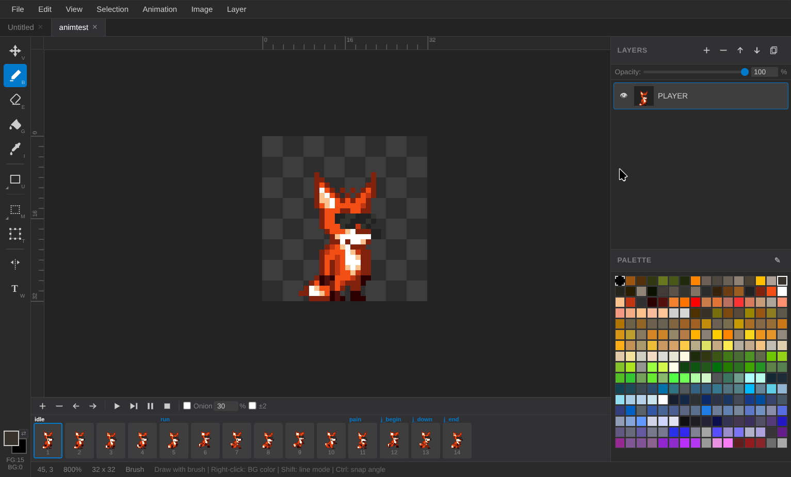

# Pix8

A browser-based 256-color indexed pixel art editor inspired by VGA-era graphics tools. Built with vanilla JavaScript and webpack.

Try it online: https://pix8.dynart.net



## Features

- **256-color indexed palette** -- all 256 entries (0-255) are usable colors, transparency is a separate sentinel value
- **Photoshop-like layout** -- toolbar with flyout groups on the left, canvas in the center, layers and palette on the right
- **Pixel-perfect zoom** -- nearest-neighbor interpolation at all zoom levels (1x-32x), pixel grid overlay at 12x+
- **Configurable grid** -- user-settable grid size with snap-to-grid support (View > Grid Settings)
- **Rulers and guides** -- pixel rulers along canvas edges; drag from ruler to create custom guide lines with snap support
- **Independent layers** -- each layer has its own size and position, auto-extends when drawing outside bounds
- **Layer operations** -- add, delete, reorder, duplicate, toggle visibility, solo, rename, opacity (0-100%), trim to content, crop to canvas, show border
- **Unified export dialog** -- single "Export as..." dialog (Ctrl+Shift+E) with format selector (BMP, PCX, PNG, GIF, SPX) and format-specific options
- **Drawing tools** -- Brush, Eraser, Color Picker, Rectangle, Filled Rectangle, Ellipse, Filled Ellipse, Flood Fill
- **Brush/Eraser line mode** -- hold Shift to draw straight lines, Ctrl to snap angles to 22.5-degree increments
- **Brush right-click** -- draw with background color using right mouse button
- **Pixel-perfect preview** -- all drawing tools show an 80% opacity preview of the exact pixels before committing
- **Move tool** -- reposition layers and floating selections; snaps layer content edges to grid lines and guides
- **Mirror tool** -- flip image or selection horizontally (click) or vertically (Shift+click)
- **Selection tools** -- Rectangle and Ellipse selection with resizable handles, edge-based boundaries that snap to grid/guides
- **Selection modifiers** -- Shift+drag to add, Alt+drag to subtract; Selection menu: Select All, Deselect, Expand, Shrink, Select by Alpha
- **Free Transform** -- move, resize, and rotate selected pixels with interactive handles (T shortcut), Ctrl snaps rotation to 22.5-degree increments
- **Text tool** -- create text layers with configurable font, size, bold/italic/underline, anti-aliased palette-mapped rendering, and palette color picker (W shortcut)
- **Multi-document tabs** -- independent documents with separate layers, palette, undo history, and zoom/pan state
- **Clipboard** -- Cut, Copy, Copy Merged, Paste, Paste in Place; automatic palette color remapping between documents; system clipboard paste with dithering
- **Truecolor image import** -- File > Open supports PNG/JPG/GIF/WebP with median-cut quantization and dithering (None/Floyd-Steinberg/Ordered Bayer)
- **Frame animation** -- sprite-sheet animation with per-frame pixel data; frame timeline with thumbnails, tag groups, play/pause/stop, tag-based playback
- **Onion skinning** -- red-tinted previous frames, blue-tinted next frames; configurable opacity; extended mode (+-2 frames)
- **GrafX2-style palette editor** -- range selection, HSV color picker (saturation/value square + hue strip), RGB sliders with hex input, batch operations (Swap, X-Swap, Copy, Flip, X-Flip, Neg, Gray, Spread, Merge, Sort, Reduce, Zap Unused, Used highlight), 6-bit VGA mode, palette Load/Save (PAL/BMP/PCX)
- **Toast notifications** -- non-blocking slide-down messages replace browser alert dialogs
- **Desktop-style menus** -- click to open, hover to switch, same for toolbar flyout groups
- **Undo/Redo** -- Ctrl+Z / Ctrl+Shift+Z, 50-step history including palette edits and all layer operations (add, delete, move, duplicate, rename, visibility, opacity)
- **SVG icons** -- all toolbar and panel icons are standalone SVG files in `images/` for easy customization

### File Formats

| Format | Import | Export | Notes |
|--------|--------|--------|-------|
| .pix8 | Yes | Yes | Native project format (layers, animation, palette) |
| BMP | Yes | Yes | 8-bit indexed color |
| PCX | Yes | Yes | 8-bit indexed color with RLE compression |
| PNG | Yes | Yes | Truecolor import with quantization, indexed export |
| JPG/GIF/WebP | Yes | -- | Truecolor import with quantization |
| GIF | -- | Yes | Animated GIF89a with LZW compression |
| SPX | -- | Yes | Sprite XML + PCX sprite sheet(s) as ZIP |
| PAL | Yes | Yes | 6-bit raw binary or 8-bit JASC-PAL text |

### Electron Desktop App

```bash
npm run electron     # Run as desktop app
npm run dist:linux   # Build Linux AppImage/deb
npm run dist:win     # Build Windows installer
npm run dist:mac     # Build macOS dmg
```

## Getting Started

```bash
npm install
npm run build    # webpack production build
npm start        # serve at http://localhost:3000
```

For development with auto-rebuild:

```bash
npm run dev      # webpack watch mode (in one terminal)
npm start        # serve (in another terminal)
```

## Keyboard Shortcuts

| Key | Action |
|-----|--------|
| V | Move tool |
| B | Brush tool |
| E | Eraser tool |
| I | Color Picker tool |
| U | Rectangle tool |
| O | Ellipse tool |
| G | Flood Fill tool |
| M | Rectangle Select tool |
| T | Free Transform tool |
| W | Text tool |
| X | Swap FG/BG colors |
| 1 | Reset brush to default (1px) |
| +/- | Zoom in/out |
| Space | Play Tag / Stop (animation) |
| Middle mouse drag | Pan canvas |
| Enter | Commit free transform |
| Escape | Cancel / deselect / commit floating selection |
| Delete | Clear selected pixels |
| Ctrl+A | Select all |
| Ctrl+D | Deselect |
| Ctrl+B | Set brush from selection |
| Ctrl+C | Copy |
| Ctrl+Shift+C | Copy merged (all layers) |
| Ctrl+X | Cut |
| Ctrl+V | Paste (centered) |
| Ctrl+Shift+V | Paste in place |
| Ctrl+Z | Undo |
| Ctrl+Shift+Z | Redo |
| Ctrl+S | Save project |
| Ctrl+Shift+E | Export as... |
| Ctrl+O | Open file |
| Ctrl+' | Toggle grid |
| Ctrl+Shift+' | Toggle snap to grid |
| Alt+R | Toggle rulers |
| Ctrl+; | Toggle guides |

## Project Structure

```
css/               CSS files (layout, dark theme, panel styles)
dist/              Webpack output (bundle.js)
docs/              Algorithm documentation
images/            SVG icons (editable with Inkscape)
js/
  app.js           Application bootstrap and wiring
  EventBus.js      Simple pub/sub event system
  constants.js     VGA palette, zoom levels, TRANSPARENT sentinel
  model/           Data model (ImageDocument, Layer, Palette, Brush, Selection)
  history/         Undo/redo manager
  render/          Compositing renderer and grid overlay
  tools/           All drawing and selection tools
  ui/              UI panels (CanvasView, Toolbar, LayersPanel, PalettePanel, etc.)
  util/            File I/O, quantization, GIF encoder, SPX exporter
index.html         Single-page entry point
webpack.config.js  Webpack configuration
```

## Technical Notes

- All pixel data is stored as `Uint16Array` with values 0-255 for palette indices and 256 for transparent pixels
- Layers are independently sized and positioned -- drawing outside bounds auto-extends with 16px growth padding
- Rendering composites layers bottom-to-top via palette lookup into RGBA `ImageData`, drawn with `imageSmoothingEnabled = false`
- GIF export uses a native LZW encoder -- no external encoding libraries
- SPX export uses skyline bin packing to minimize sprite sheet area within 320x200 VGA constraints
- JSZip is the only runtime dependency (for SPX ZIP export)

## Known Issues

- **Subpixel rendering glitches at fractional display scaling** -- grid lines, guides, and selection marching ants may appear misaligned or jittery on displays with scaling other than 100% or 200% (e.g., 125%, 150%). This is caused by CSS pixels not aligning with physical device pixels at fractional `devicePixelRatio` values. Fixing this would require DPR-aware canvas rendering throughout the entire canvas stack -- not yet planned.
